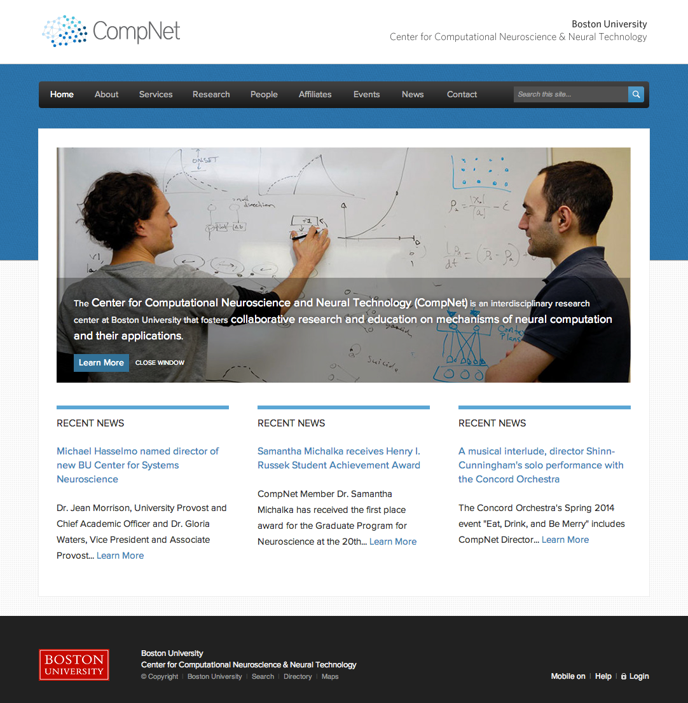
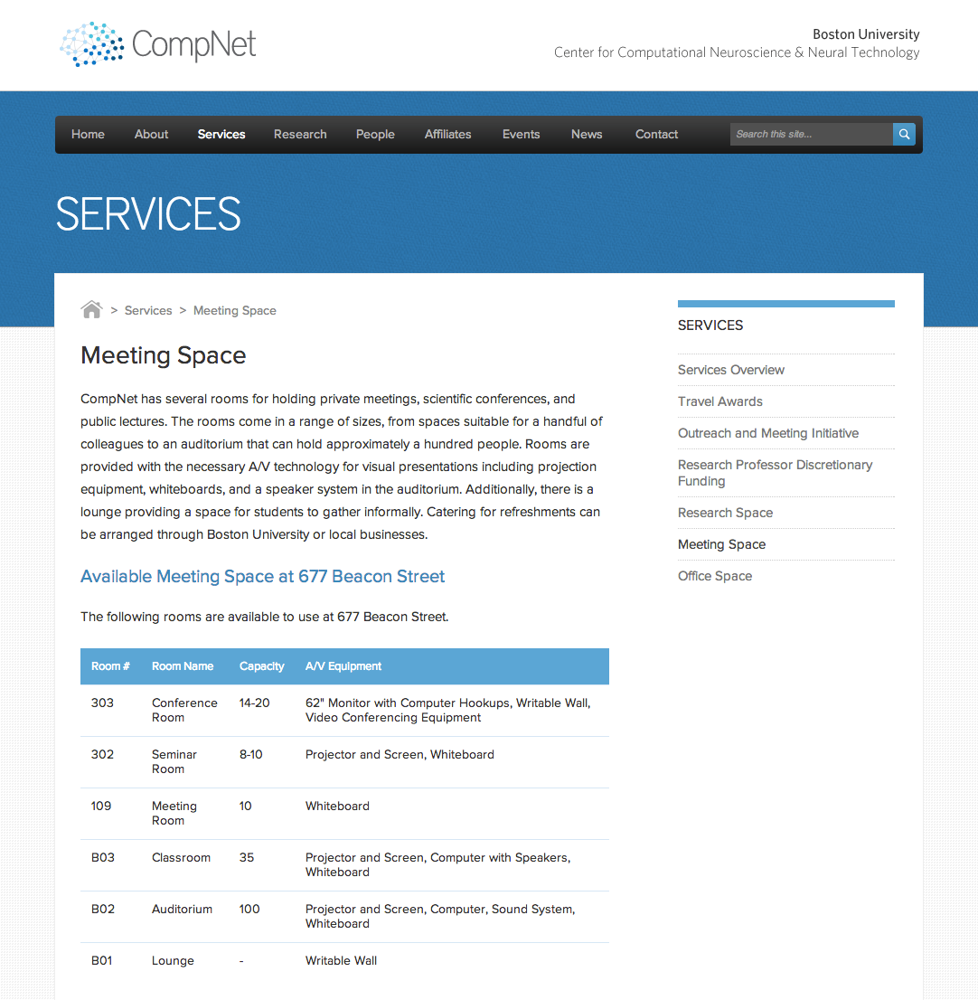

About
================================================================================

The front-end for the [CompNet](http://compnet.bu.edu) website. Custom design and
responsive front-end code, wrapped up as a WordPress theme.

The live site hooks into a CodeIgniter backend through a RESTful API. This
API communication code has been omitted from this repository, making this
a clean, usable, and standalone WordPress theme.

### Homepage ###

### Content ###

License
================================================================================

All code written by me is released under MIT license. See the attached
license.txt file for more information, including commentary on license choice.
